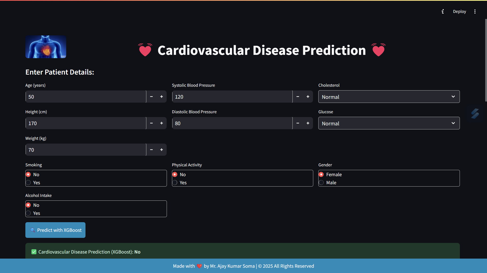

# Cardiovascular Disease Prediction

<h2>📌 Overview</h2>

The Cardiovascular Disease Prediction application is a machine learning-based tool built with Streamlit to predict the likelihood of cardiovascular disease using patient data. The model used for prediction is <b>XGBoost</b>, a powerful gradient-boosting algorithm.

<h2>🏗 Features</h2>
<ul>
    <li><b>User Input Form:</b> Users can enter patient details such as age, blood pressure, cholesterol level, glucose level, and lifestyle habits.</li>
    <li><b>Machine Learning Model:</b> Uses a pre-trained XGBoost model for predictions.</li>
    <li><b>Data Scaling:</b> Standardized input data using Scikit-Learn's StandardScaler.</li>
    <li><b>Real-time Prediction:</b> Provides instant prediction results on cardiovascular disease likelihood.</li>
    <li><b>Visualization:</b>
        <ul>
            <li>Confusion Matrix for model performance evaluation.</li>
            <li>Feature Importance chart for understanding influential features.</li>
            <li>Model Accuracy display.</li>
        </ul>
    </li>
</ul>

<h2>🛠 Technologies Used</h2>
<ul>
    <li> Python</li>
    <li> Streamlit (for UI)</li>
    <li> XGBoost (for prediction)</li>
    <li> Pandas & NumPy (for data processing)</li>
    <li> Matplotlib & Seaborn (for visualization)</li>
    <li> Scikit-learn (for data scaling & evaluation)</li>
</ul>

<h2>📊 Model Details</h2>
<ul>
    <li><b>Algorithm:</b> XGBoost</li>
    <li><b>Performance:</b>
        <ul>
            <li>The accuracy of the model is displayed in the app.</li>
            <li>Confusion matrix helps in assessing model performance.</li>
            <li>Feature importance helps in understanding key health factors.</li>
        </ul>
    </li>
</ul>

<h2>📸 Screenshots</h2>

 

<h2>🤝 Contributors</h2>
<ul>
    <li><b>Mr. Ajay Kumar Soma</b> - Developer & Model Trainer</li>
</ul>

<h2>📜 License</h2>

<b>This project is licensed under the CC BY-NC 4.0 License. You may not use it for commercial purposes without permission.</b>

<h2>⚠️ Disclaimer</h2>

This model provides predictions based on statistical analysis and should not be used as a substitute for professional medical advice. Always consult a healthcare professional for medical concerns.

